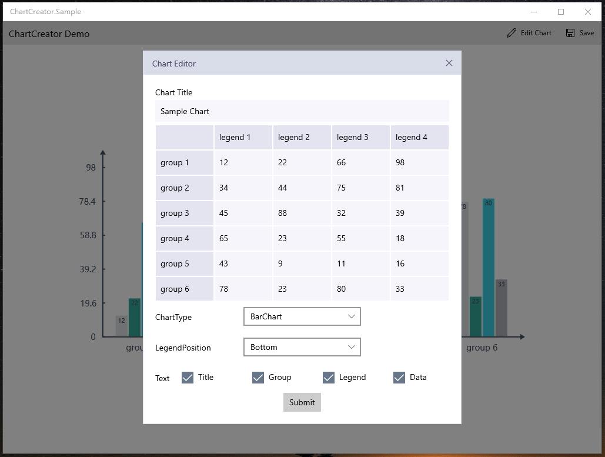

# ChartCreator
ChartCreator can generate custom style chart image(bar,line,pie) on the UWP platform.

ChartCreator 是一套UWP图表工具，可以生成自定义的图表（柱状图，折线图，饼图）图片。

## Download
UWP:download from [Nuget](https://www.nuget.org/packages/ChartCreator/)
### use ChartCreator ###
    var chart = new LineChart
                    {
                        Values = values,
                        Style =JsonConvert.DeserializeObject<LineChartStyle>(styleJson)
                    };
    var canvasCommandList = chart.GetChartImage();
    var bitmap=await canvasCommandList.GetSoftwareBitmapAsync();
### sample App ###

[This is a sample app](https://github.com/HHChaos/ChartCreator/tree/master/ChartCreator.Sample)

