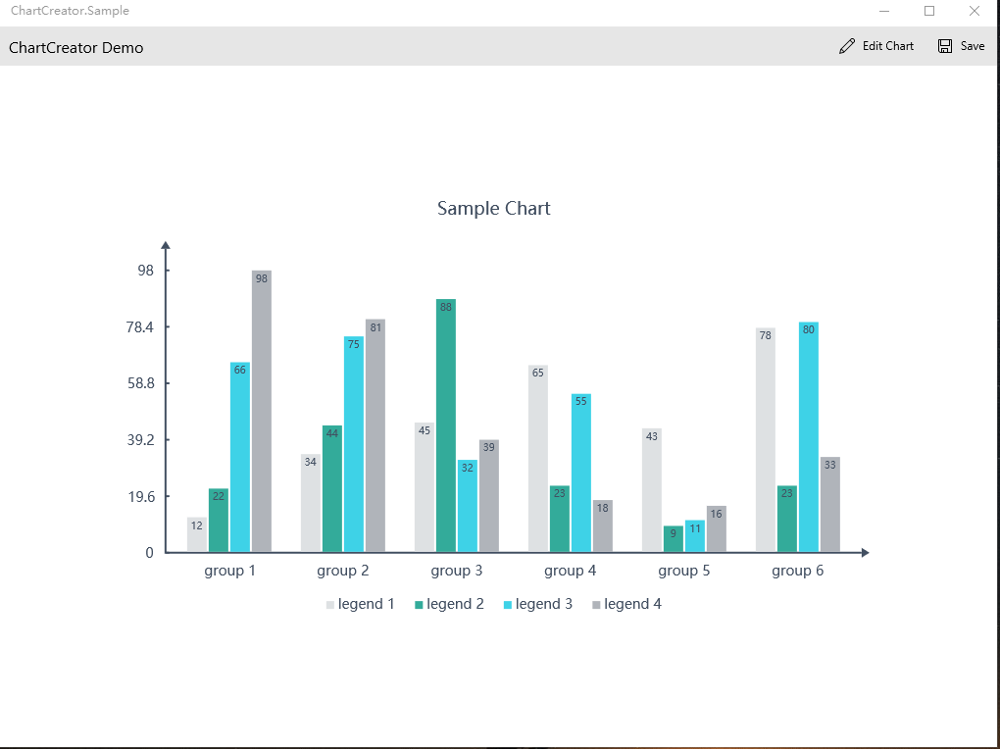

# ChartCreator
ChartCreator can generate custom style chart image(bar,line,pie) on the UWP platform.

## Download
UWP:download from [Nuget](https://www.nuget.org/packages/ChartCreator/)
### use ChartCreator ###
    var chart = new LineChart
                    {
                        Values = values,
                        Style =JsonConvert.DeserializeObject<LineChartStyle>(styleJson)
                    };
	var canvasCommandList = chart.GetChartImage();
	var bitmap=await canvasCommandList.GetSoftwareBitmapAsync();
### sample photo ###

