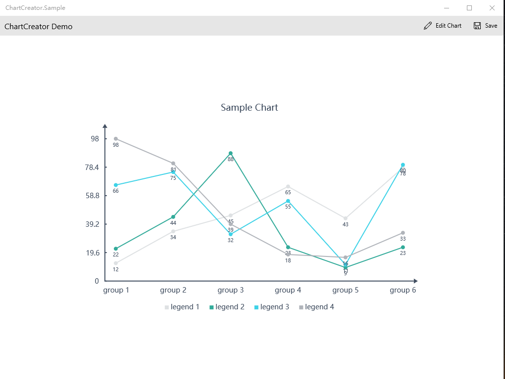
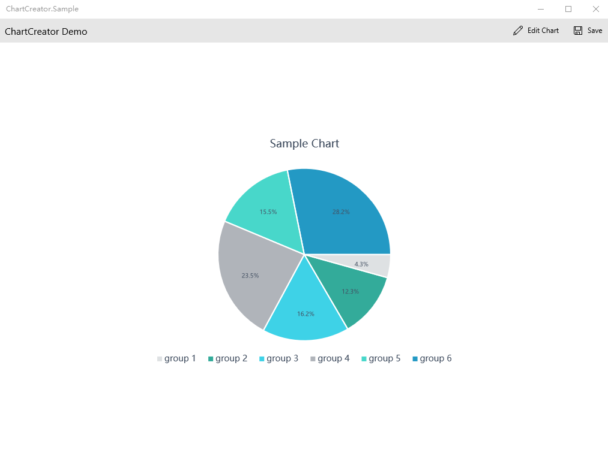

# ChartCreator
uwp ChartCreator
### use ChartCreator ###
    var chart = new LineChart
                    {
                        Values = values,
                        Style =JsonConvert.DeserializeObject<LineChartStyle>(styleJson)
                    };
	var bitmap = await chart.GetChartBitmapAsync();
### sample photo ###

